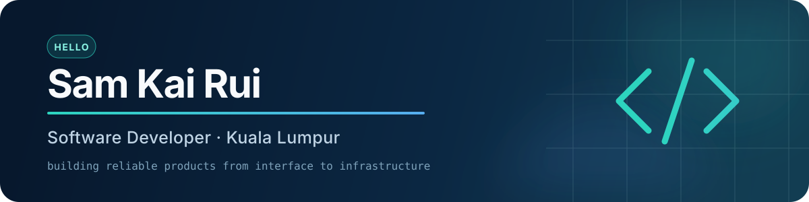

  

   

  
  

## About me

I am a Software Developer based in Kuala Lumpur, interested in building practical products and dependable backend systems. I enjoy working across the stack—from designing responsive interfaces to developing APIs, event-driven services, and cloud-ready applications.

- Building a **Digital Banking System** with Spring Boot microservices, Kafka, Redis, and Saga-style transaction workflows
- Developing full-stack applications with **Laravel, Inertia, React, Vue, and Spring Boot**
- Exploring distributed systems, application security, and production deployment
- Open to Software Developer opportunities and collaborative projects

## Tech stack

**Backend & data**

**Frontend**

**Tools & delivery**

## Featured projects

### [Digital Banking System](https://github.com/kairui1012/digital-banking-system)

A Java and Spring Boot microservices backend for accounts, transfers, fraud screening, payments, and event-driven notifications. It uses Kafka for asynchronous workflows, Redis for rate limiting and temporary OTP storage, and Saga-style compensation for failed transfers.

`Java 17` `Spring Boot` `Apache Kafka` `Redis` `MySQL` `Docker`

### [JomStudy](https://github.com/kairui1012/FYP)

A full-stack study platform designed to support learning, community interaction, and resource sharing through a unified web experience.

`Laravel` `Inertia.js` `React` `TypeScript` `PostgreSQL` `Docker`

### [Mental Health Assistant](https://github.com/kairui1012/mental-health-assistence)

A full-stack mental wellness application that combines a Vue interface with a Java backend to provide accessible mental health support features.

`Vue.js` `Java` `Spring Boot`

[View live application](https://mental-health-assistence.vercel.app)

### [Developer Portfolio](https://github.com/kairui1012/react_website)

A responsive personal portfolio presenting my projects, skills, and approach to software development.

`React` `TypeScript` `Vite` `Tailwind CSS`

[View live portfolio](https://kairui.engineer)

---

  Thanks for visiting. Feel free to explore my repositories and follow what I am building.

