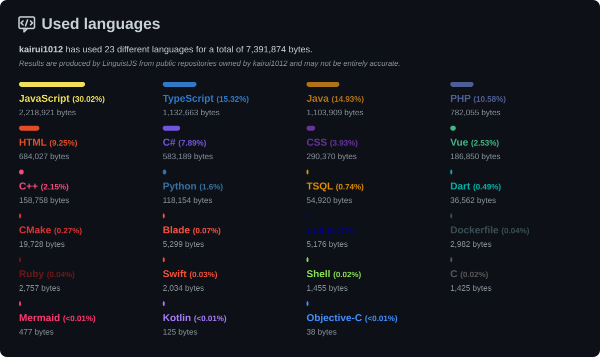

## About me

  
  
  

I am a Software Developer based in Malaysia, interested in building practical products and dependable backend systems. I enjoy working across the stack—from designing responsive interfaces to developing APIs, event-driven services, and cloud-ready applications.

- Building **FlashTicket** and a **Digital Banking System** with Spring Boot microservices, Kafka, Redis, and MySQL
- Implementing event-driven workflows, atomic inventory operations, idempotent processing, and Saga-style compensation
- Developing full-stack applications with **Laravel, Inertia, React, Vue, and Spring Boot**
- Interested in distributed systems, application security, production deployment, and Software Developer opportunities

## Project

### [Digital Banking System](https://github.com/kairui1012/digital-banking-system)

An event-driven banking backend that coordinates transfers across independent Spring Boot services. Kafka-based Saga workflows compensate failed transfers, while Redis-backed fraud checks, five-minute OTP verification, account blocking, and API Gateway rate limits protect sensitive operations.

`Java 17` `Spring Boot` `Apache Kafka` `Redis` `MySQL` `Docker`

### [FlashTicket](https://github.com/kairui1012/flashticket)

A high-concurrency ticketing backend built as Java 21 microservices. Redis Lua scripts reserve and release stock atomically, while Kafka, a transactional outbox, and idempotent compensation keep inventory, orders, and Stripe payments consistent through success, cancellation, and expiry flows.

The complete Stripe Test Mode payment path was validated from hosted Checkout and signed webhooks to Payment `SUCCEEDED` and Order `PAID`. In a direct Inventory Service JMeter run, the system processed 10,000 competing requests at approximately **1,905.9 requests/second** without overselling; the figure includes expected sold-out responses and excludes API Gateway overhead.

`Java 21` `Spring Boot` `Spring Cloud Gateway` `Spring Security` `Apache Kafka` `Redis Lua` `MySQL` `MyBatis` `Flyway` `Stripe` `Docker` `JMeter`

### [Java Shell](https://github.com/kairui1012/terminal)

An interactive Unix-style shell written in Java 21 to explore how command interpreters work. It combines quote-aware parsing, built-in commands, PATH-based process execution, separate stdout/stderr overwrite and append redirection, and JLine tab completion in a continuous REPL.

`Java 21` `JLine` `Maven` `ProcessBuilder`

### [JomStudy](https://github.com/kairui1012/FYP)

A full-stack learning platform built with Laravel 12, React 19, TypeScript, and Inertia. It integrates DeepSeek for multilingual explanations and quiz generation, tracks question-level mistakes and learning progress for teacher insights, and uses transaction-safe point awards with cached weekly, monthly, and all-time leaderboards.

`Laravel 12` `Inertia.js` `React 19` `TypeScript` `DeepSeek API` `PostgreSQL` `Docker`

[View live application](https://jomstudy.me/)

### [Mental Health Assistant](https://github.com/kairui1012/mental-health-assistence)

A Vue 3 mental wellness frontend that streams AI-assisted counselling responses through SSE and preserves multi-session conversation history with emotion and risk insights. It also provides role-protected user and administrator flows, centralized token-expiry handling, and ECharts dashboards for consultation and activity trends.

`Vue 3` `Vite` `Server-Sent Events` `Vue Router` `Axios` `Element Plus` `ECharts`

[View live application](https://mental-health-assistence.vercel.app)

## Tech stack

**Backend**

**Databases**

**Frontend**

**Tools & delivery**

## Used languages

  

